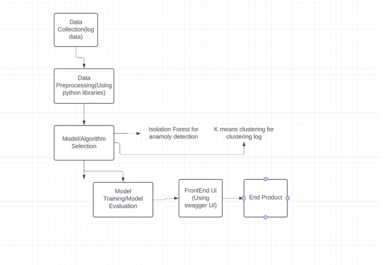
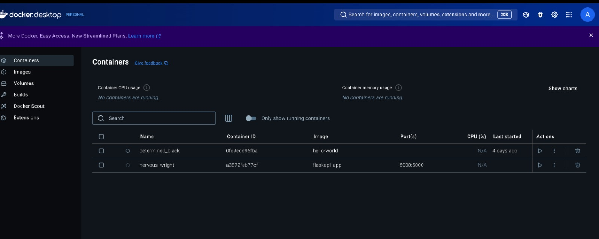
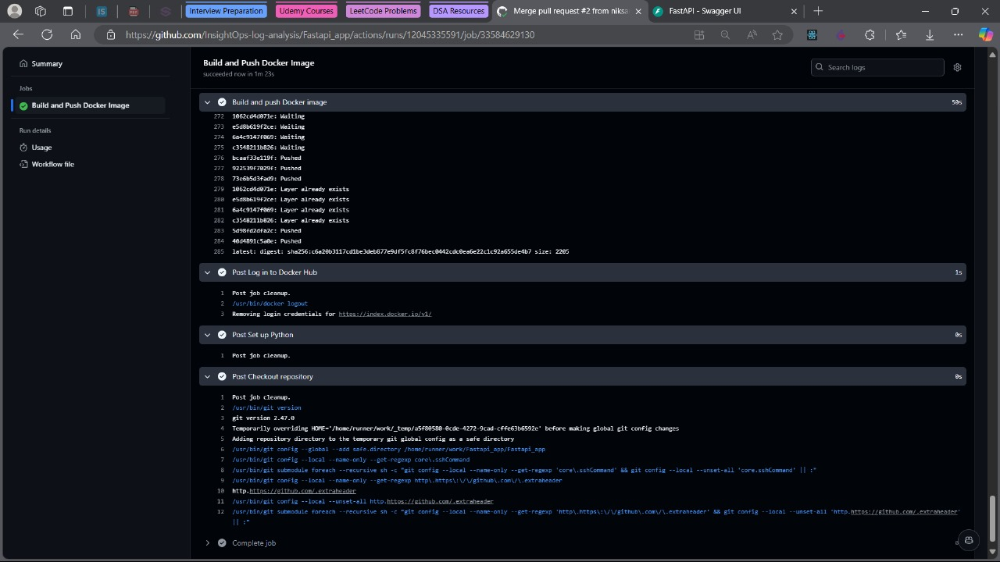
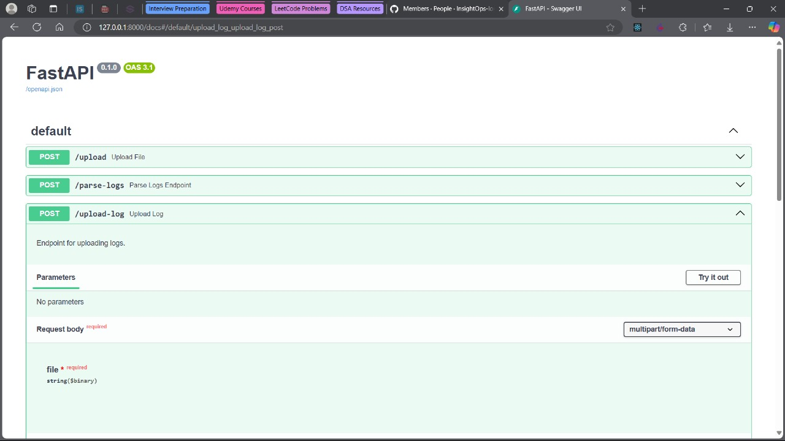
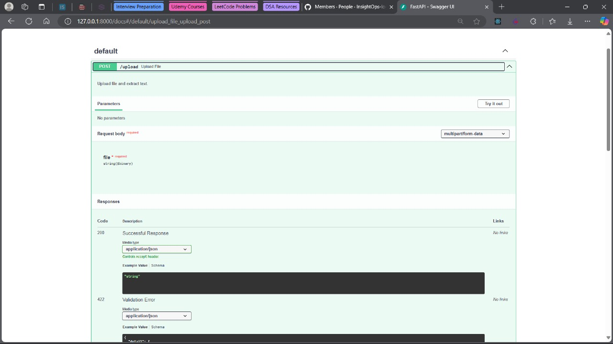
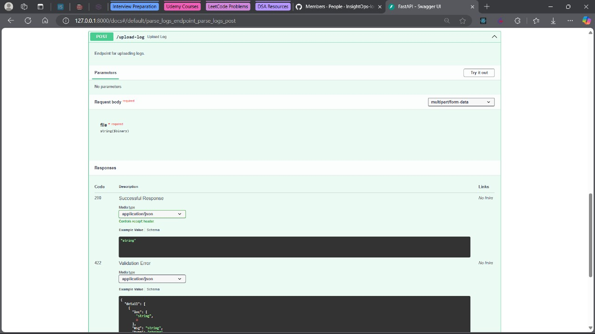
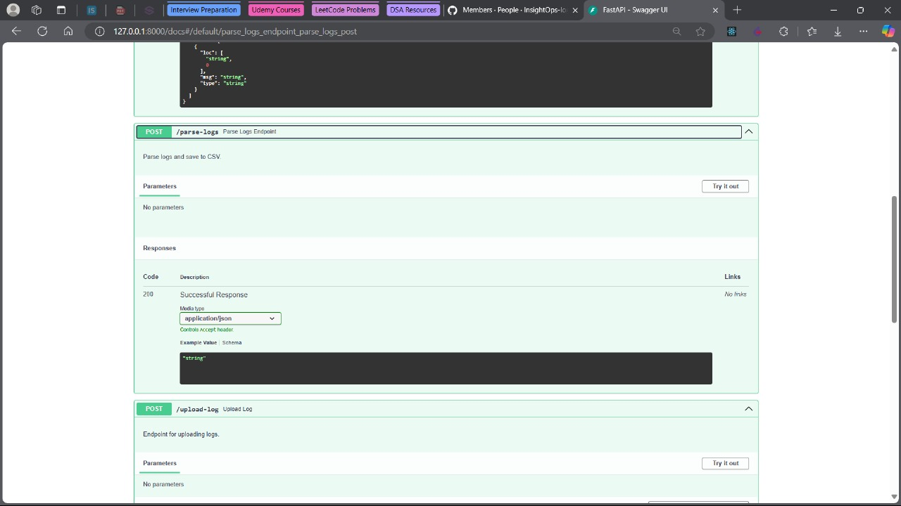
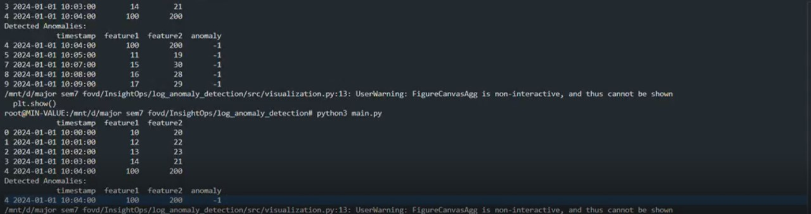

# InsightOps
## _Anomaly Detection and Log Analysis Tool_


[](https://travis-ci.org/siddharthaaa21/insightops)

InsightOps is a fast and scalable anomaly detection and log analysis tool designed to help organizations identify patterns, performance issues, and operational anomalies from log files. It integrates machine learning models for anomaly detection and generates insightful visualizations to assist in troubleshooting and monitoring.


- Parse logs and detect anomalies

- Extract text from PDFs and images
- Visualize anomalies with plots
- ✨Automation ✨

## Features

- Log Parsing: Extract text from PDFs and images (PNG/JPG).
- Log Analysis: Parse logs and detect anomalies using machine learning techniques.
- Visualization: Create and save anomaly detection plots for easy interpretation.
- File Uploading: Handle various file formats (PDF, images, log files) for automated processing.
- CSV Export: Convert parsed logs into structured CSV format for further analysis.

Logs can be converted into structured data, analyzed for performance issues, and visualized in an intuitive 


## Tech

InsightOps uses several technologies to ensure seamless functionality:


- [Python 3.7+] - Backend programming
- [FastAPI] - Modern, fast web framework for building APIs
- [matplotlib] - For data visualization
- [pandas] - Data manipulation and analysis library
- [scikit-learn] - Machine learning model implementation
- [uvicorn] - ASGI server for FastAPI applications

And of course Dillinger itself is open source with a [public repository][dill]
 on GitHub.

## Installation

InsightOps requires Python 3.7+ to run.


Install the dependencies and start the server:

bash
Copy code
# Clone the repository
add the link here 
cd insightops

# Create a virtual environment
python -m venv venv
source venv/bin/activate   # On Windows use `venv\Scripts\activate`

# Install the dependencies
pip install -r requirements.txt

```sh
python -m venv venv
source venv/bin/activate   # On Windows use `venv\Scripts\activate`

# Install the dependencies
pip install -r requirements.txt
```

For production environments...

```sh
export UPLOAD_FOLDER="/path/to/uploads"
export LOG_FILE="/path/to/logfile.log"
export CSV_OUTPUT="/path/to/output.csv"
export ANOMALY_PLOT="/path/to/anomaly/plot"

```

## Usage
```
uvicorn app.main:app --reload
```


## Screenshots


- **Workflow Image**  
  
  
- **Docker Image**  
  

- **Docker Build Success**  
  

- **Main FastAPI Docs Page**  
  

- **Upload File (Text Extraction)**  
  

- **Upload Logs (Custom Logs)**  
  

- **Parse Log (Parsing Uploaded File)**  
  
  
- **Log Parsing Process(Result)**  
  


## Contributing
We welcome contributions to InsightOps! To contribute:

Fork the repository.
Create a new branch for your changes.
Make your changes and commit them.
Push the changes to your fork.
Create a pull request to the main repository.


## License


**Free Software, Hell Yeah!**
